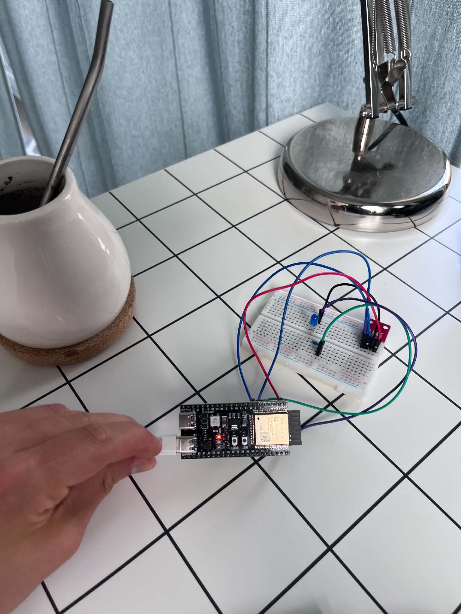
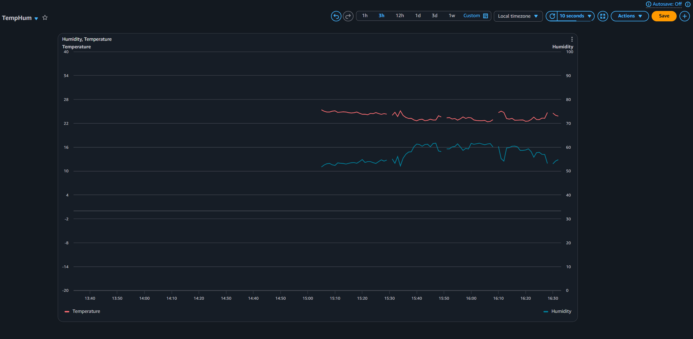
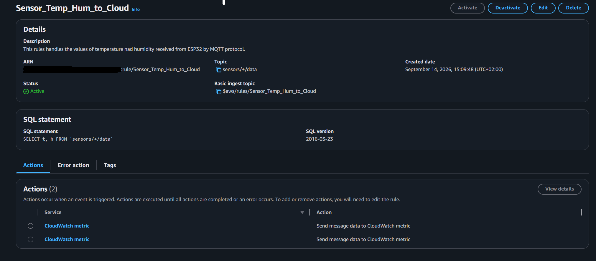

# ESP32 Sensor AWS Iot Core

Celem tego projektu było zintegrowanie czujnika temperatury i wilgotności na ESP32 z AWS IoT Core -> publiczną usługą firmy Amazon służącą do łączenia urządzeń IoT z chmurą, bezpiecznego zarządzania nimi oraz przetwarzania generowanych przez nie danych. AWS działa jako broker MQTT i stanowi punkt wejścia dla wszelkich danych przesyłanych przez urządzenie do chmury.

The goal of this project was to integrate a temperature and humidity sensor based on the ESP32 with AWS IoT Core—Amazon’s public service for connecting IoT devices to the cloud, securely managing them, and processing the data they generate. AWS acts as an MQTT broker and serves as the entry point for all data transmitted by the device to the cloud.


## Breadboard



## AWS Dashboard



## Policy (JSON) 

```json
{
  "Version": "2012-10-17",
  "Statement": [
    {
      "Effect": "Allow",
      "Action": "iot:Connect",
      "Resource": "arn:aws:iot:eu-central-1:<ACCOUNT_ID>:client/<CLIENT_ID>"
    },
    {
      "Effect": "Allow",
      "Action": "iot:Publish",
      "Resource": "arn:aws:iot:eu-central-1:<ACCOUNT_ID>:topic/sensors/<CLIENT_ID>/data"
    }
  ]
}
```
## Rule Settings 



## How it works

1. The ESP32-S3 wakes up from deep sleep and connects to WiFi.
2. It reads temperature and humidity from an HTU21D sensor over I2C.
3. The reading is published to AWS IoT Core over MQTT as JSON, e.g. `{"t":23.45,"h":58.20}`, on the topic `sensors/<client_id>/data`.
4. The device goes back to deep sleep for 60 seconds.

The readings are visualized on an Amazon CloudWatch dashboard.

## Design assumptions

- **Secure connection:** MQTT runs over TLS (port 8883) with mutual authentication. The device verifies AWS with the Amazon Root CA, and AWS verifies the device with its X.509 certificate issued by AWS IoT Core.
- **Low power:** the radio is on only for a few seconds per wake-up. If WiFi or MQTT is not reachable within the timeout, the reading is dropped and the device sleeps instead of draining the battery.
- **No secrets in the repository:** WiFi credentials, the AWS endpoint and certificates are kept in files excluded by `.gitignore`.
